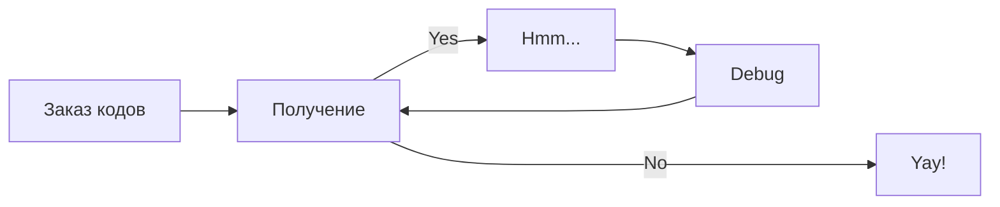
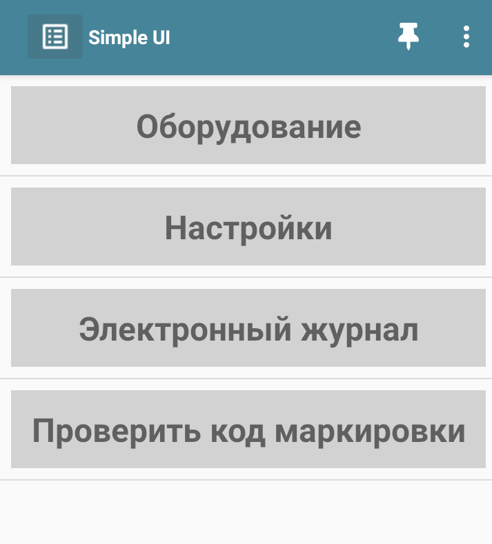

# Цех глазированных сырков

## Общая схема работы

## Фасовка сырков на палочке

<figure markdown>
  {width="200"}
  <figcaption>Image caption</figcaption>
</figure>

## Отчет о нанесении

<figure markdown>
  {width="200"}
  <figcaption>Image caption</figcaption>
</figure>

## Корректировка отчета о нанесении

<figure markdown>
  {width="200"}
  <figcaption>Image caption</figcaption>
</figure>

## Отчет о вводе в оборот

<figure markdown>
  {width="200"}
  <figcaption>Image caption</figcaption>
</figure>

## Еще один раздел

<figure markdown>
  {width="200"}
  <figcaption>Image caption</figcaption>
</figure>

## Следующий раздел

<figure markdown>
  {width="200"}
  <figcaption>Рисунок 4. Успешное завершение операции.</figcaption>
</figure>

