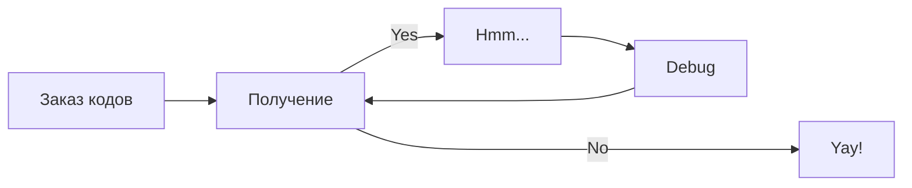

# Цех глазированных сырков

## Общая схема работы

## Фасовка сырков на палочке

<figure markdown>
  {width="200"}
  <figcaption>Image caption</figcaption>
</figure>

## Отчет о нанесении

## Корректировка отчета о нанесении

## Отчет о вводе в оборот

